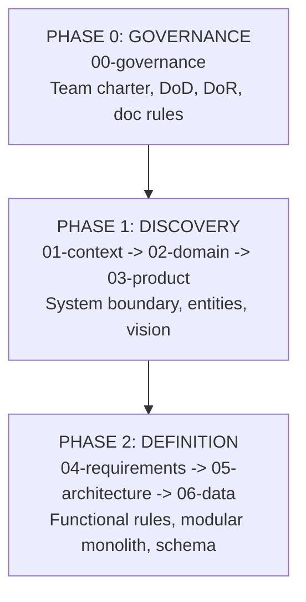

# SDD Guide — Software Design Documentation

## What is SDD?

**Software Design Documentation (SDD)** is an engineering practice where system
design, architecture invariants, and business rules are documented and reviewed
**before** implementing production code.

```
Traditional:  Code  ->  Documentation (rarely updated)
SDD:          Documentation  ->  Code  ->  Living Documentation
```

### Core SDD Principles

1. **Design Before Code:** Decisions must be written, structured, and reviewed.
2. **Living Documentation:** Documentation evolves alongside codebase changes.
3. **Traceability:** Requirements map to domain invariants and automated tests.

## Lifecycle Phases (00 to 06)

The project documentation lifecycle covers governance, discovery, and definition:



## Structure and Directory Mapping

| Order | Path | Core Question Answered |
|---|---|---|
| 1 | [`00-governance/`](00-governance/README.md) | How does the team work, agree, and secure the codebase? |
| 2 | [`01-context/`](01-context/README.md) | What are the boundaries, stakeholders, and vocabulary? |
| 3 | [`02-domain/`](02-domain/README.md) | What are the business entities, rules, and invariants? |
| 4 | [`03-product/`](03-product/README.md) | What is the product vision, problem framing, and roadmap? |
| 5 | [`04-requirements/`](04-requirements/README.md) | What are the functional and non-functional requirements? |
| 6 | [`05-architecture/`](05-architecture/README.md) | How is the modular monolith organized and decoupled? |
| 7 | [`06-data/`](06-data/README.md) | What are the database schema, models, and migrations? |

## Documentation Enforcement

All files across folders `00-governance/` through `06-data/` strictly follow:
- **Line Count:** Between 25 and 80 lines per markdown document.
- **No Instruction Markers:** Zero unresolved placeholder blocks.
- **Verification:** Automated linter validation via test runner.

