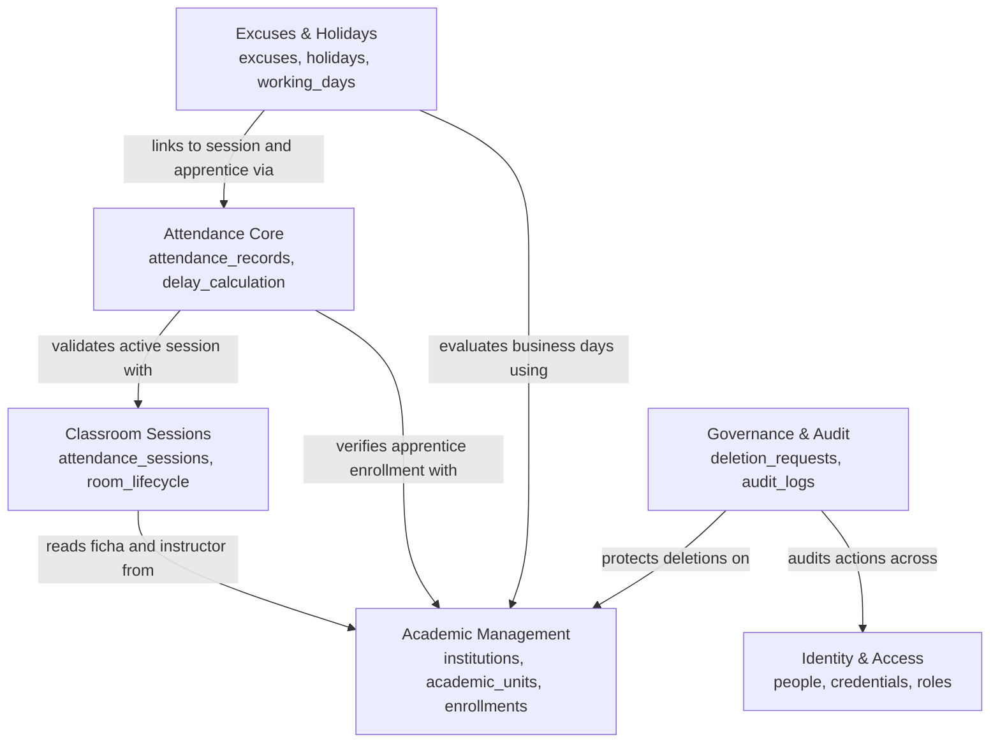

# 02 — Domain Map

## Bounded contexts

## Context relationships

| Relationship | Interaction Type |
|---|---|
| Sessions -> Academic | Synchronous read-only query to verify ficha ownership |
| Attendance -> Sessions | Validates session status is `active` and token is valid |
| Excuses -> Sessions | Reads `activated_at` to calculate 3-business-day deadline |
| Governance -> Academic | Transitions ficha to `PENDING_DELETION` and `DELETED` |

---

**Related:** [`entities-and-rules.md`](./entities-and-rules.md) · [`module-boundaries.md`](./module-boundaries.md)
