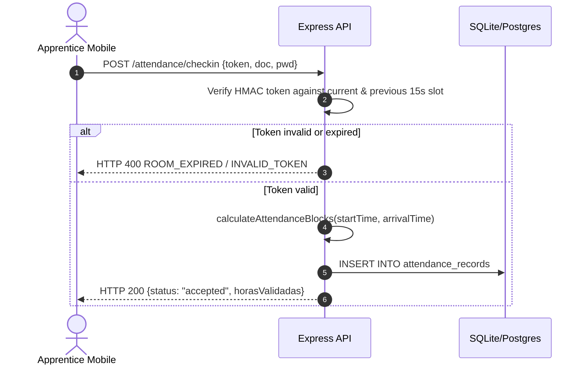
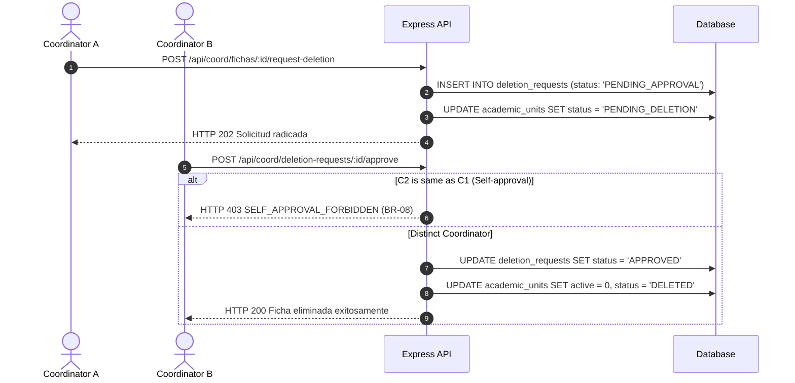

# 08 — Diagram Index

## 1. Sequence: Dynamic QR Check-in Flow

## 2. Sequence: Four-Eyes Ficha Deletion

---

**Related:** [`../02-domain/entities-and-rules.md`](../02-domain/entities-and-rules.md) · [`../07-api/rest-conventions.md`](../07-api/rest-conventions.md)
